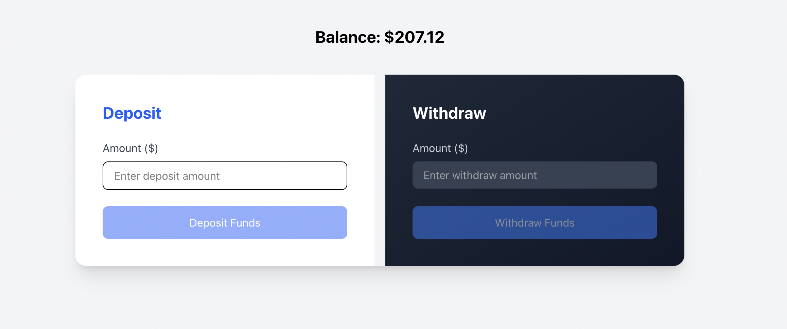
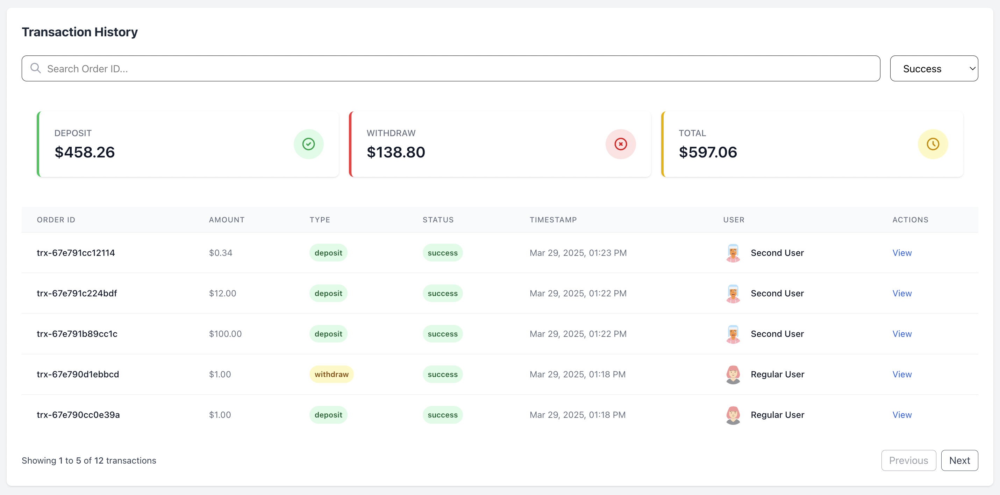

# CPP Payment Gateway
Simple payment gateway. Built with Laravel. **Without Inertiajs**.
Backend API and SPA vue js 3 as frontend in one repository.






#### Requirement
- PHP version >= 8.0
- Mysql
- Node js >= 20

#### Installation
Clone this project or download

#### Setup
- ###### Create `.env` file by copy `.env.example`
    ```bash
    cp .env.example .env
    ```
- ###### Install packages
    ```bash
    composer install
    ```
- ###### Generate key
    ```bash
    php artisan key:generate
    ```
- ###### Setup environment
    ```bash
    APP_URL=http://cpp-gateway.test
    ...
    DB_CONNECTION=mysql
    DB_HOST=127.0.0.1
    DB_PORT=3306
    DB_DATABASE=ccp_gateway
    DB_USERNAME=root
    DB_PASSWORD=
    ```
- ###### Migration and Seeder
    ```bash
    php artisan migrate:fresh --seed
    ```

- ###### Access http://cpp-gateway.test
#### Frontend Development
```bash
npm install
npm run dev
```

###### build for production  if needed
```bash
npm run build
```

#### Postman
[Postman collection](https://github.com/huiralb/cpp-gateway/blob/master/docs/cpp-gateway.postman_collection.json)
